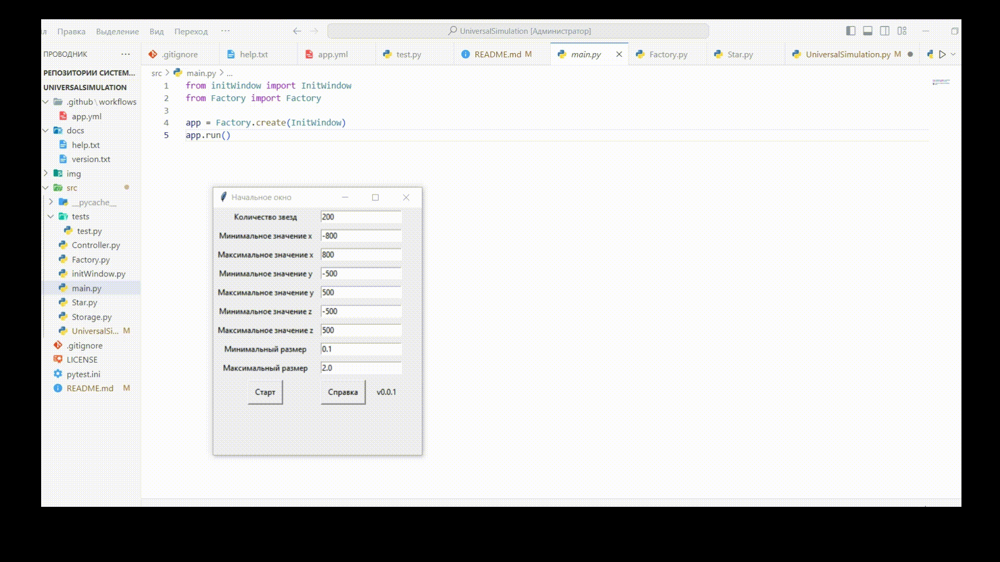
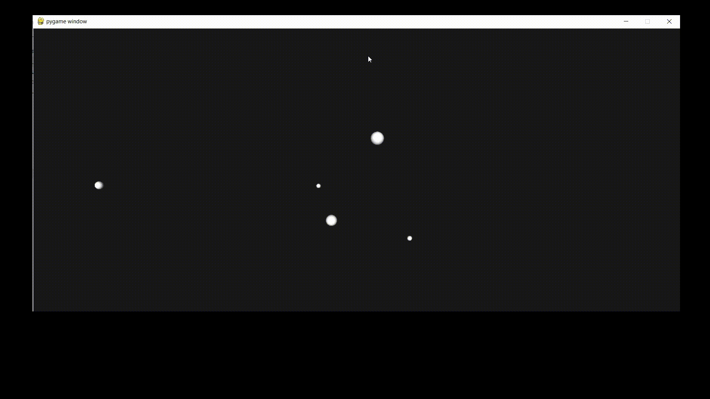

[](https://github.com/RailSafiullin/UniversalSimulation/actions/workflows/app.yml)
[](https://opensource.org/licenses/Apache-2.0)
# Лабораторная работа по дисциплине "Компьютерная графика" №5
# UniversalSimulation

## Content

- [Preview](#preview)

- [How to install](#how-to-install-and-start)

- [Task 3](#task-3)

- [License](#license)


## Preview

Application for modeling the universe (several stars, from time to time one of them flares up, increasing in size, the other goes out) 

Animation of the application's initial window and simulation



Universal animation



## How to install and start

```cmd

git clone https://github.com/RailSafiullin/UniversalSimulation
cd UniversalSimulation
pip install pyopengl
pip install pygame
pip install numpy
python main.py

```

## Task 21

Требуется составить программу-имитацию Вселенной (несколько звезд, время от времени одна из них вспыхивает, увеличиваясь в размерах, другая гаснет, уменьшаясь).

## License

Distributed under the MIT License. See LICENSE.txt for more information.


